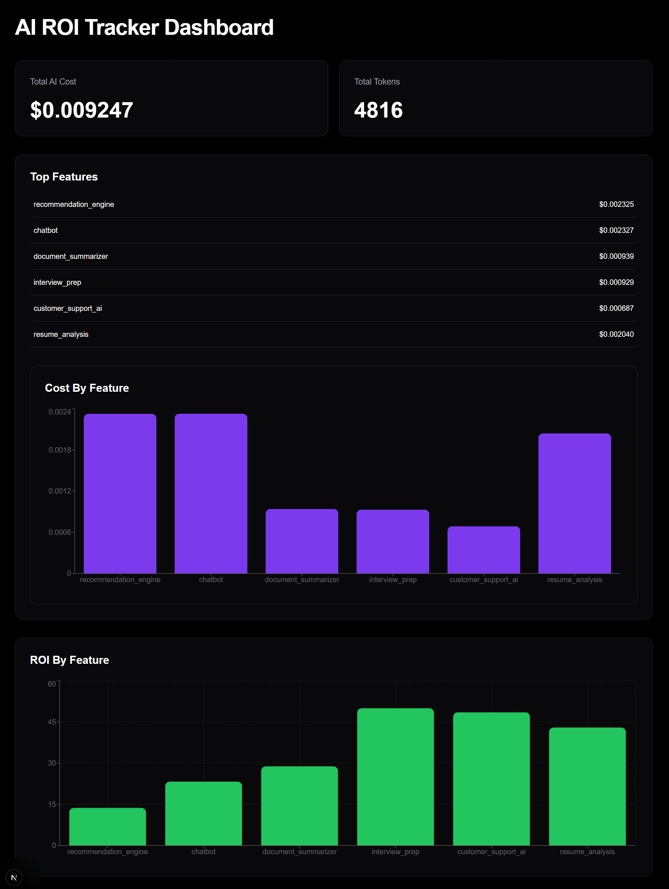
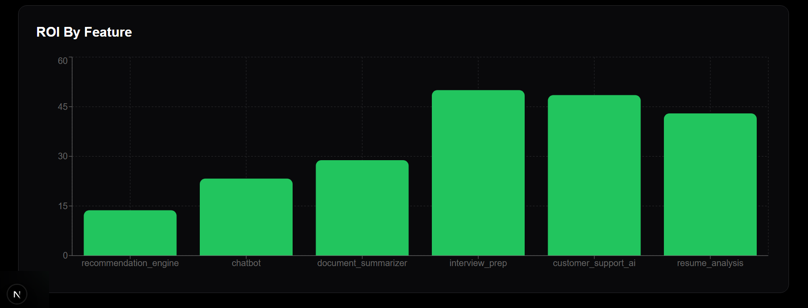
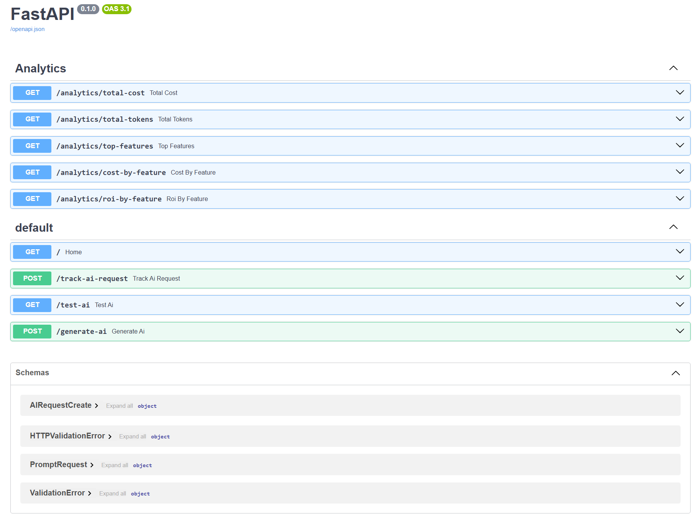

# AI ROI Tracker
AI ROI Tracker is a full-stack AI analytics platform that monitors AI feature usage, token consumption, infrastructure cost, and feature-level ROI.

The platform helps identify which AI-powered product features generate the highest business value relative to AI spending.

## Features

- AI request tracking
- Token usage analytics
- Cost monitoring
- Feature-level aggregation
- ROI calculation engine
- Interactive analytics dashboard
- PostgreSQL telemetry storage
- Recharts data visualization
- FastAPI backend
- Next.js frontend

## Tech Stack

### Backend
- FastAPI
- SQLAlchemy
- PostgreSQL
- Groq API

### Frontend
- Next.js
- React
- Tailwind CSS
- Recharts

### Database
- PostgreSQL

## Architecture Flow

User Prompt
    ↓
FastAPI Backend
    ↓
Groq LLM API
    ↓
Token + Cost Extraction
    ↓
ROI Calculation
    ↓
PostgreSQL Storage
    ↓
Analytics APIs
    ↓
Next.js Dashboard


## ROI Formula

The ROI engine estimates business value generated relative to AI infrastructure spend.

```math
ROI = \frac{Retention\ Score - AI\ Cost}{AI\ Cost}
```

## Dashboard Preview

### Main Dashboard


---

### ROI Analytics



---

### FastAPI Swagger APIs



## Future Improvements

- Multi-model routing
- AI optimization recommendations
- Daily analytics trends
- Alert system
- Automatic model downgrading
- AI budget allocation engine

## Local Setup

### Backend

cd backend

pip install -r requirements.txt

uvicorn app.main:app --reload

### Frontend

cd frontend

npm install

npm run dev
